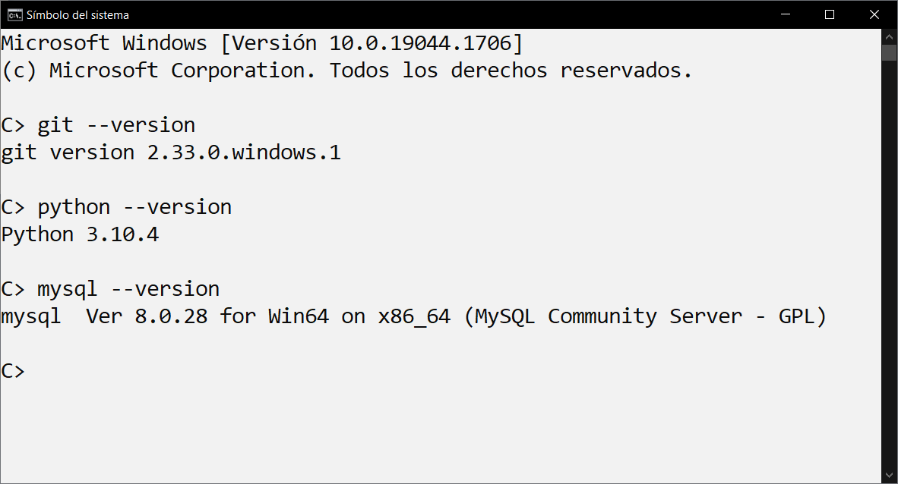

# 🧩 Lo Básico para practicar Programación Python 🧩

Guia de herramientas mínimas para comenzar con Python en Windows 10 para practicar código.


## 📑 Instalación Git:

Instalar Git, una vez que se instala tendremos disponible en la consola de Windows los comandos para interactuar con GitHub. Esto servirá para casi todo lo que hagamos en Github. Instalación obligada.

Ante la duda, instalamos la version "32-bit Git for Windows Setup"


link:
https://git-scm.com/download/win


## ☕ Instalación Python:

Instalacion del Intérprete de Python:

Para Windows 10 Instalar la última version. Por ahora la 3.10

Para Windows 7 Instalar la última posible. Que es la 3.8.10. Desde la 3.9 no funcionan con Windows 7


Link
[https://www.python.org/downloads/](https://www.python.org/downloads/windows/)


## 💾 Instalación MySql: 

Instalacion de MySQL para gestionar, crear bases de datos. Descargar la version "Windows (x86, 32-bit), MSI Installer 	8.0.29 	439.6M" la de mayor tamaño que salga en la lista, que trae todo lo necesario incluido el Workbench para diseñar las bases de datos. 

link:
[https://dev.mysql.com/downloads/installer/](https://dev.mysql.com/downloads/installer/)


---

**😀 Tip:** Nos guardaremos los instaladores por si los necesitamos para arreglar las instalaciones y ahorrar tiempo o no tenemos internet. Pueden ser llevados en pen drive a otras PC y ser instalados ahorrando espacio y datos de tráfico. 👍

---


Una vez instalados los 3 softwares básicos abrimos una consola de comandos de Windows. **(La buscamos en el inicio o hacemos Tecla Windows + R, ahi escribimos CMD y damos a enter)**


 
---

**😬 Otro Tip:** Si la buscamos en el inicio, recomiendo anclar a barra de tareas haciendo click derecho a su icono y eligiendo la opción de anclar. Asi está visible y a mano al instante en el escritorio.

---


Ejecutamos los tres comandos para revisar si se instalaron nuestras herramientas básicas. Presionamos enter luego de cada uno para ver si muestra su versión instalada. Si alguno indica error hay que revisar o reinstalarlo.

````

git --version

python --version

mysql --version

````




✔ En las respuestas podemos que que responden ok los programas. Quiere decir que tenemos lo necesario. Lo unico que va a variar son las versiones ya que pueden salir más nuevas luego de esta guía.

---
**☝ Final Tip:**

Cuando ya se tiene todo instalado, podemos regularmente mantener actualizado el gestor de paquetes de software de pthon, el cual nos permitirá instalar nuevas funcionalidades, librerías, y también programas hechos en python creados por la comunidad.

### Actualizar a la última versión de Pip, el gestor de paquetes de software de python:

````

python -m pip install --upgrade pip

````
---
<br>

# 📘 Instalación Editor de Código:

La facultad nos recomienda Visual Studio Code, opcion System Installer 32 bit.

https://code.visualstudio.com/download#


<br>

## Otros Editores alternativos:

No es obligatorio usar Visual Studio Code pero es el más utilizado hoy, y tiene mucha asistencia inteligente cuando se está codificando, sugerencias, correcciones, aviso de errores antes de ejecutar el código etc.

Si no lo pueden usar por PC lenta, o por otro motivo técnico pueden usar desde el Block de Notas de Windows, Notepad++, o Atom que es similar a Visual Studio Code y es el editor de Github oficial. Pueden usar que quieran y sea más cómodo y se sientan mejor. Ya que python es sólo código en texto común que es ejecutado por el intérprete que instalaron.

